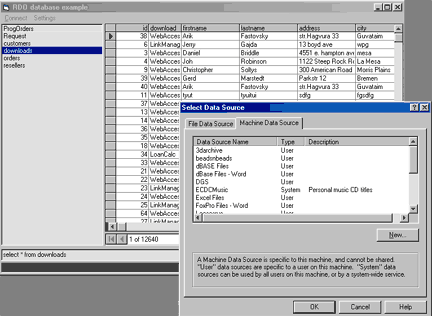



## RDOdbExample

### Description

Connect to any ODBC compliant db using RDO.

by the way MySQL, Oracle, FoxPro, Excel, Access, Sybase are all ODBC compatible. Use this code to connect to Unix databases, Linux databases, etc.

Very simple (easy to follow) code.

If you would like to see the same in ADO, or want me to add DB creation/editing capabilities let me know. Currently you can just add, update and delete records as well as run queries.

Please Vote, I stayed up late working on this.

Comments positive and negative welcome.
 
### More Info
 

             |
---                |---
**Submitted On**   |2002-04-03 06:24:10
**By**             |[RegX](https://github.com/Planet-Source-Code/PSCIndex/blob/master/ByAuthor/regx.md)
**Level**          |Intermediate
**User Rating**    |4.5 (89 globes from 20 users)
**Compatibility**  |VB 6\.0
**Category**       |[Databases/ Data Access/ DAO/ ADO](https://github.com/Planet-Source-Code/PSCIndex/blob/master/ByCategory/databases-data-access-dao-ado__1-6.md)
**World**          |[Visual Basic](https://github.com/Planet-Source-Code/PSCIndex/blob/master/ByWorld/visual-basic.md)
**Archive File**   |[RDOdbExamp68260432002\.zip](https://github.com/Planet-Source-Code/regx-rdodbexample__1-33386/archive/master.zip)

